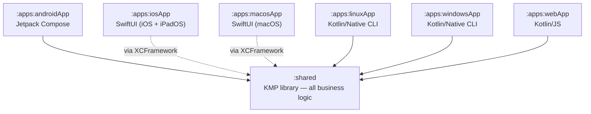
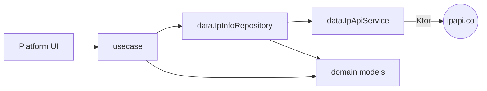
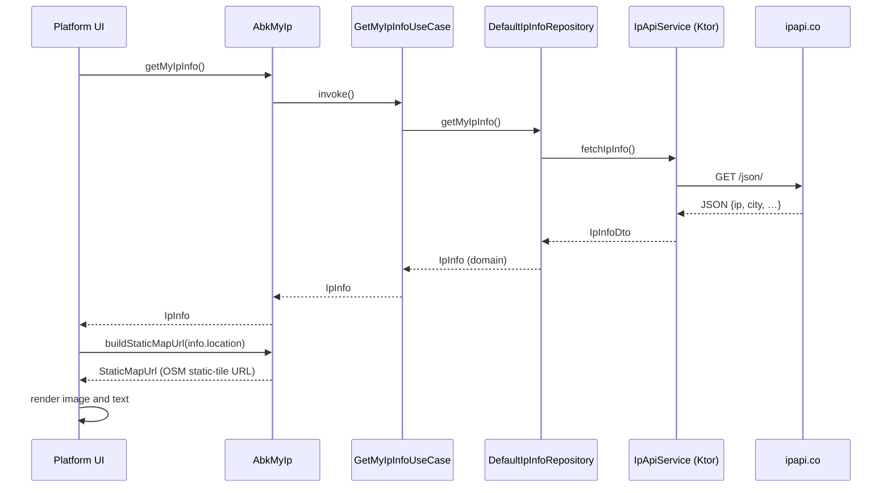
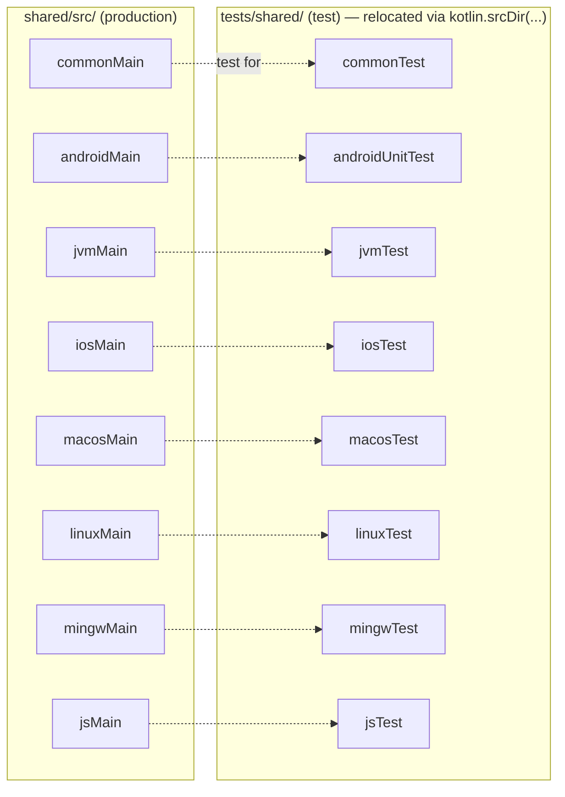

# Architecture

## Module dependency graph

## Layered design inside `shared`

- `domain/` — pure immutable data classes (`IpInfo`, `GeoLocation`, `StaticMapUrl`).
- `data/` — HTTP-layer (`IpApiService` via Ktor + kotlinx.serialization) and the repository that maps DTOs to domain types.
- `usecase/` — one entry point per user-facing operation (`GetMyIpInfoUseCase`, `BuildStaticMapUrlUseCase`).
- `platform/` — minimal `expect`/`actual` surface: `httpClient()` and `platformName`.
- `AbkMyIp` — application-composition root, exposes use cases ready to call.

## Request flow

## Test layout

Production binaries cannot pull in test code because `tests/` is not under any `src/` tree — Gradle source-set rewiring is the only path that exposes those files to compilation, and it is only configured for the `*Test` source sets.
