# Kotlin primer for experienced developers

A mental model of Kotlin and Kotlin Multiplatform (KMP) for a polyglot coming from Python, TypeScript, C#, C/C++, and Xamarin. Diagram-first, prose second.

For *this project's* architecture — module graph, layered design inside `shared/`, request flow — see [`architecture.md`](architecture.md). This document is about Kotlin the language and KMP the platform model, not about `abkMyIP` specifically.

---

## 1. Why Kotlin exists

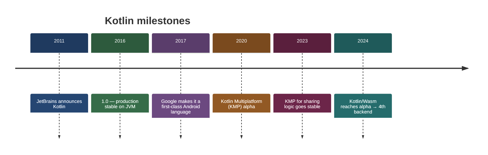

Kotlin started as JetBrains' answer to Java's verbosity — pragmatic, statically typed, fully Java-interop. Today it's a four-backend language (JVM, Native, JS, Wasm) and the foundation of Kotlin Multiplatform.

---

## 2. The four Kotlin compilers — foundational picture

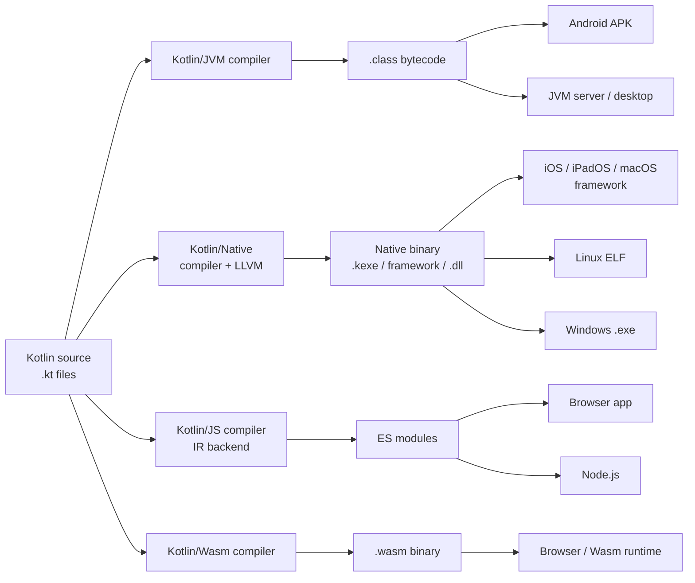

**One source tree → many backends.** This is the foundation of KMP. The `shared/` module in this repo compiles via Kotlin/JVM (for Android + JVM tests), Kotlin/Native (for iOS, macOS, Linux, Windows), and Kotlin/JS (for the web app). Same `.kt` files, different backend per target.

---

## 3. Language tour — side-by-side with what you already know

| Concept | Python | TypeScript | C# | Kotlin |
|---|---|---|---|---|
| Mutable / immutable binding | (no keyword) | `let` / `const` | `var` / `readonly` | `var` / `val` |
| Type inference | dynamic | yes | yes (`var`) | yes (`val x = 1`) |
| Data record | `@dataclass` | `interface { ... }` | `record` | `data class` |
| Null in type system | `Optional[T]` | `T \| null` (strict) | `T?` (nullable refs) | `T?` (built-in, enforced at compile time) |
| Static members | module-level fn | `static` on class | `static` | `companion object` |
| Extension methods | monkey-patch | declaration merging | `static class` ext | `fun Foo.bar()` — first-class |
| Sealed hierarchy | (none idiomatic) | discriminated union | `sealed` (C# 9+) | `sealed class/interface` + exhaustive `when` |
| Default + named args | yes | object-literal trick | yes | yes (`f(name = "x", age = 3)`) |
| Async primitive | `async/await` | `async/await` | `async/await`, `Task` | `suspend fun` + coroutines |
| String interpolation | `f"hi {name}"` | `` `hi ${name}` `` | `$"hi {name}"` | `"hi $name"` / `"${expr}"` |
| Pattern matching | `match` (3.10+) | switch on union tag | `switch` + patterns | `when` (expression, exhaustive) |
| Lambda | `lambda x: x*2` | `(x) => x*2` | `x => x*2` | `{ x -> x*2 }` or `{ it * 2 }` |

The table covers ~80% of the daily-use surface. Sections 4–6 zoom in on the parts most likely to surprise you.

---

## 4. Type system specifics

### Null safety is enforced

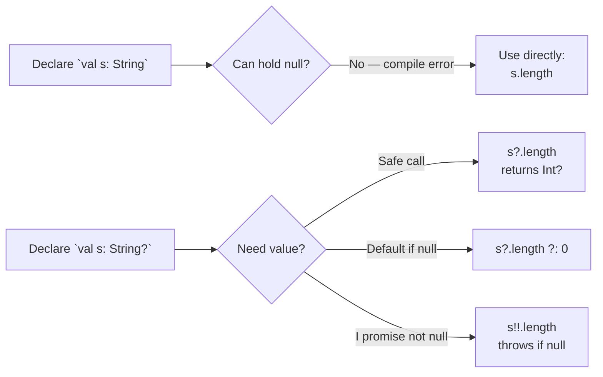

The headline: `String` and `String?` are **different types**. The compiler will not let you call `.length` on a `String?` without one of `?.`, `?:`, `!!`, or a smart-cast guard. This catches at compile time what C# nullable-refs only warns about and what Python/JS catch at runtime.

```kotlin
val a: String = "hi"      // never null
val b: String? = null     // may be null
b?.length                 // Int?   — null if b is null
b?.length ?: 0            // Int    — 0 if b is null
b!!.length                // Int    — NPE if b is null (use sparingly)
```

### Smart casts

```kotlin
fun describe(x: Any) = when (x) {
    is String -> "len=${x.length}"   // x is String here, no cast
    is Int    -> "even=${x % 2 == 0}"
    else      -> "?"
}
```

Like TypeScript narrowing, but built into the compiler for `is` / `as` / null checks. No `(x as String).length` ceremony.

### Generics: variance and reified

- `out T` = covariant (producer) — like C# `out`, TS would call it `readonly`-ish.
- `in T` = contravariant (consumer) — like C# `in`.
- `reified T` inside `inline fun` keeps the type at runtime — you can write `if (x is T)` inside a generic function. C# needs `typeof(T)`, Java erases entirely.

```kotlin
inline fun <reified T> List<Any>.filterIsInstance(): List<T> =
    filter { it is T }.map { it as T }
```

---

## 5. Object-Oriented and Functional Programming blend

```mermaid
graph TD
    A[class User] --> B[primary constructor:<br/>val name: String, var age: Int]
    A --> C["init &#123; &#125; block — runs at construction"]
    A --> D[member functions: fun greet&#40;&#41; = ...]
    A --> E[secondary constructors — optional]
    F[data class<br/>auto: equals/hashCode/copy/componentN/toString] -.-> A
    G[object User : singleton] -.-> A
    H[companion object — static-like<br/>holders inside a class] -.-> A
```

Key shapes:

- **Primary constructor on the class header**: `class User(val name: String, var age: Int)`. Properties declared inline.
- **`data class`** auto-generates `equals`, `hashCode`, `copy`, `componentN`, `toString` — like C# `record`. Used everywhere for DTOs and value objects (this project's `IpInfo`, `GeoLocation`).
- **`object` keyword** = compile-time singleton. No `new`, no instance management.
- **`companion object`** inside a class = the spot for "static" members. You access them as `User.create(...)`.
- **Top-level functions** are normal — no class wrapper. `package com.abk` then `fun main() { ... }` is the file.
- **Trailing lambda syntax**: `list.map { it * 2 }` — the lambda lives outside the parens when it's the last argument. `it` is the implicit single parameter.
- **Delegation via `by`**: `class Foo : Bar by other` forwards all `Bar` methods to `other`. `val name by lazy { compute() }` is lazy initialization without boilerplate.

---

## 6. Design Patterns — most dissolve into the language

```mermaid
graph LR
    SING[Singleton] --> OBJ["object keyword"]
    FACT[Factory] --> COMP["companion object<br/>+ factory fun"]
    BLD[Builder] --> NAM["named/default args<br/>+ apply &#123; &#125; / buildList &#123; &#125;"]
    STRAT[Strategy] --> LAM["lambda parameter:<br/>fun f&#40;t: &#40;X&#41; -&gt; Y&#41;"]
    DEC[Decorator] --> EXT["extension fn / by delegation"]
    OBS[Observer] --> FLOW["Flow / StateFlow"]
    VIS[Visitor] --> SLD["sealed class + exhaustive when"]
    CMD[Command] --> SUSP["suspend fun / lambda"]
    ITER[Iterator] --> ITB["Iterable / Sequence"]
    CHN[Chain of Responsibility] --> INT["coroutine interceptors<br/>&#40;Ktor plugins&#41;"]
    ADP[Adapter] --> EXT
```

Each Gang-of-Four pattern collapses into a single language feature. You'll write `object Foo { … }` instead of a 40-line double-checked-locking singleton.

### The dissolution table

| Pattern | Java/C++/C# version | Kotlin version |
|---|---|---|
| Singleton | private ctor + static `getInstance()` + locking | `object Foo { fun work() = … }` |
| Factory | abstract class hierarchy with `createX()` | `companion object { fun create() = … }` or top-level `fun` |
| Builder | inner `Builder` class + fluent `.x(v).build()` | named + default args, or `apply { }` / `buildList { } / buildString { }` |
| Strategy | `interface Strategy { execute() }` + impls | lambda parameter: `fun run(s: (Int) -> Int)` |
| Decorator | wrapper class implementing same interface | extension fn, or `class W : T by inner { … }` |
| Adapter | wrapper class translating interface | extension functions |
| Observer | `addListener` / `removeListener` plumbing | `Flow` / `StateFlow` / `SharedFlow` |
| Iterator | implement `hasNext` / `next` | implement `Iterable<T>` or use `sequence { yield(x) }` |
| Visitor | double-dispatch boilerplate | `sealed class` + `when (x) { is A -> …; is B -> … }` |
| Command | `interface Command { execute() }` | a `suspend fun` or a lambda |
| Chain of Responsibility | linked handler list | coroutine interceptors (Ktor's plugin pipeline works this way) |

### Tiny examples — the ones you'll write most

```kotlin
// Singleton
object Logger {
    fun info(msg: String) = println("[INFO] $msg")
}
// Use: Logger.info("hi")
```

```kotlin
// Builder via apply { }
val request = HttpRequest().apply {
    url = "https://ipapi.co/json/"
    method = "GET"
    headers["Accept"] = "application/json"
}
```

```kotlin
// Visitor via sealed + when (compile-time exhaustive)
sealed interface Result<out T>
data class Ok<T>(val value: T) : Result<T>
data class Err(val message: String) : Result<Nothing>
data object Loading : Result<Nothing>

fun <T> render(r: Result<T>) = when (r) {       // no else needed — compiler verifies exhaustive
    is Ok      -> "got ${r.value}"
    is Err     -> "fail: ${r.message}"
    Loading    -> "…"
}
```

### Where patterns still earn their keep

Big structural patterns don't dissolve — they're the scaffolding of large systems and Kotlin doesn't replace them:

- **Repository** — boundary between business logic and data sources (this project: `IpInfoRepository`)
- **Use Case / Interactor** — one operation per class, the Clean Architecture spine (this project: `GetMyIpInfoUseCase`, `BuildStaticMapUrlUseCase`)
- **MVI / MVVM** — UI architectures, especially with Compose + `StateFlow`
- **Dependency Injection** — Koin or Hilt; manual wiring (composition root) also works fine for small projects like this one (`AbkMyIp.kt` is the composition root)

For how those map together in this project, see [`architecture.md`](architecture.md).

---

## 7. Coroutines — the biggest paradigm shift

### What `suspend` means

`suspend fun` marks a function that can pause and resume. The keyword is **viral** (callers must also be `suspend` or be inside a coroutine scope) but **free** at runtime — the compiler rewrites it into a state machine. Zero allocation beyond the underlying continuation.

### Structured concurrency

```mermaid
graph TD
    SCOPE[CoroutineScope<br/>parent Job]
    SCOPE --> C1["launch &#123; ... &#125;<br/>child Job 1"]
    SCOPE --> C2["launch &#123; ... &#125;<br/>child Job 2"]
    SCOPE --> C3["async &#123; ... &#125;<br/>child Deferred"]
    C1 --> G1[grandchild]
    C2 --> G2[grandchild]
    SCOPE -. cancel parent .-> CANCEL[all children cancel]
```

Every coroutine has a parent scope. Cancelling the parent cancels every descendant. This is the part C# `Task` and JS `Promise` do **not** have — they're unstructured by default; orphan tasks leak and need manual `CancellationToken` plumbing. Kotlin makes structure the default; you have to opt out (via `GlobalScope`) to get the C#/JS behavior, and you almost never should.

### The vocabulary

| Concept | Closest C# / JS analogue |
|---|---|
| `suspend fun` | `async` function |
| `launch { }` | fire-and-forget `Task.Run` |
| `async { }` returning `Deferred<T>` | `Task<T>` |
| `.await()` | `await` |
| `Job` | `CancellationTokenSource` + `Task` rolled together |
| `CoroutineScope` | structured lifetime — no direct analogue |
| `Dispatchers.IO` | `Task.Run` on the IO thread pool |
| `Dispatchers.Main` | UI thread (Android/JS) |
| `Flow<T>` | `IAsyncEnumerable<T>` / cold `Observable` |
| `StateFlow<T>` | `BehaviorSubject` / Rx replay-1 |
| `SharedFlow<T>` | hot multicast — `Subject` |

### Tiny example

```kotlin
suspend fun loadUser(id: String): User = coroutineScope {
    val profile = async { api.profile(id) }
    val avatar  = async { api.avatar(id) }
    User(profile.await(), avatar.await())   // runs both in parallel; cancels both if one fails
}
```

If `api.profile()` throws, `coroutineScope` cancels the `avatar` request automatically — no leaks, no manual token threading.

---

## 8. Reactive Programming — `Flow` is the native answer to RxJS / RxPY

```mermaid
graph TD
    F["Flow&lt;T&gt;<br/>COLD<br/>starts when collected"]
    SF["SharedFlow&lt;T&gt;<br/>HOT, multicast<br/>configurable replay"]
    ST["StateFlow&lt;T&gt;<br/>HOT, replay-1<br/>always has a value"]
    F --> SF
    SF --> ST
    F -. "emits to" .-> COL["one collector<br/>.collect &#123; … &#125;"]
    SF -. "emits to N" .-> COL1[collector 1]
    SF -.-> COL2[collector 2]
    ST -. "exposed as" .-> VAL[".value : T<br/>read like a property"]
```

The three-level taxonomy: `Flow` (cold, one collector at a time) → `SharedFlow` (hot, broadcast) → `StateFlow` (hot, always has a current value). Built into `kotlinx.coroutines` — no extra dependency.

### Two options for reactive code in Kotlin

| Option | When to pick it |
|---|---|
| **Kotlin Flow** (kotlinx.coroutines) | Default for any new code. Suspend-friendly, structured-concurrency-aware, KMP-native. What we'd use in this project if we needed streams. |
| **RxJava / RxKotlin** | Existing Android codebases that already use Rx. Full ReactiveX operator set. Coroutine ↔ Rx interop adapters exist (`asFlow()` / `asObservable()`). |

### RxJS / RxPY → Kotlin Flow translation

| ReactiveX (RxJS, RxPY, RxJava) | Kotlin Flow |
|---|---|
| `Observable<T>` (cold) | `Flow<T>` |
| `Subject<T>` (hot, multicast) | `MutableSharedFlow<T>` |
| `BehaviorSubject<T>` (hot, replay-1) | `MutableStateFlow<T>` |
| `ReplaySubject<T>(n)` | `MutableSharedFlow(replay = n)` |
| `Single<T>` | `suspend fun(): T` |
| `Completable` | `suspend fun()` |
| `.subscribe(onNext)` | `.collect { … }` (inside a coroutine) |
| `.map`, `.filter`, `.take`, `.scan` | same names |
| `combineLatest` | `combine` |
| `switchMap` | `flatMapLatest` |
| `mergeMap` / `flatMap` | `flatMapMerge` |
| `concatMap` | `flatMapConcat` |
| `debounceTime` | `debounce` |
| `distinctUntilChanged` | same |
| `share()` / `publish()` | `.shareIn(scope, …)` / `.stateIn(scope, …)` |
| `Scheduler` (`subscribeOn` / `observeOn`) | `Dispatcher` (`.flowOn(Dispatchers.IO)`) |

### The philosophical difference

**Rx schedules on threadpools you wire up. Flow runs on coroutine dispatchers you already have.**

That means:

- **Backpressure is free** — `Flow` is `suspend`-based, so a slow collector naturally pauses the producer. Rx needed `Observable` → `Flowable` plus explicit strategies.
- **Cancellation is structural** — cancel the parent `CoroutineScope` and every active flow collection stops. No `Disposable` bag to manage.
- **No `Subscription` lifecycle** — you don't `subscribe`/`dispose`; you `collect` inside a coroutine whose scope owns the lifetime.

### Tiny Flow example

```kotlin
fun searchAsYouType(input: Flow<String>): Flow<List<Result>> = input
    .debounce(300)                                  // wait for typing to settle
    .distinctUntilChanged()                          // skip duplicates
    .filter { it.length >= 2 }                       // ignore single chars
    .flatMapLatest { query -> api.search(query) }    // cancel in-flight on new query
    .flowOn(Dispatchers.IO)                          // upstream runs on IO threads
```

Compare to RxJS — same operators, same names, same shape. The migration from RxJS or RxPY is mostly muscle memory.

### Flow in this project

Not used yet — `GetMyIpInfoUseCase` is a one-shot `suspend fun` returning `IpInfo`, which is the right call for a single HTTP fetch. If we later add features like "auto-refresh when network changes" or "stream of location updates", `Flow<IpInfo>` is the shape we'd reach for, exposed via `StateFlow` to the UI for current-value semantics.

---

## 9. Kotlin Multiplatform — the heart of this project

### Source set hierarchy

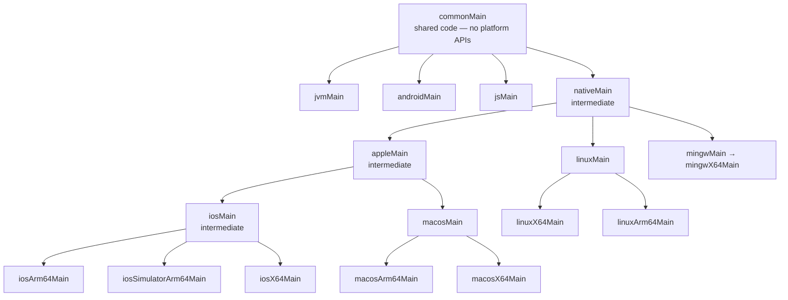

Source sets form a tree. Code in `commonMain` is visible to everything below it. Code in an intermediate set like `appleMain` is visible to all Apple targets (iOS, macOS) but not Android/JVM. The `*Test` source sets mirror the same tree.

This is why we can put Darwin-specific code (URLSession, NSDate, etc.) in `appleMain` once and have it apply to every iOS and macOS leaf target — no duplication.

### `expect` / `actual`

```mermaid
graph LR
    EXP[commonMain:<br/>expect fun httpClient&#40;&#41;: HttpClient]
    EXP -. resolved at compile time .-> A1[androidMain:<br/>actual httpClient&#40;&#41; = HttpClient&#40;OkHttp&#41;]
    EXP -.-> A2[iosMain:<br/>actual httpClient&#40;&#41; = HttpClient&#40;Darwin&#41;]
    EXP -.-> A3[linuxMain:<br/>actual httpClient&#40;&#41; = HttpClient&#40;Curl&#41;]
    EXP -.-> A4[mingwMain:<br/>actual httpClient&#40;&#41; = HttpClient&#40;WinHttp&#41;]
    EXP -.-> A5[jsMain:<br/>actual httpClient&#40;&#41; = HttpClient&#40;Js&#41;]
```

`expect` declares a hole. Each target source set fills it with an `actual`. The compiler resolves the pairing per target — call sites in `commonMain` see only the `expect` signature and remain platform-agnostic.

In this repo: `shared/src/commonMain/kotlin/com/abk/myip/platform/Platform.kt` holds the `expect` declarations, and each per-target file (`Platform.android.kt`, `Platform.ios.kt`, …) holds the `actual`. Ktor follows the same pattern — its `HttpClient` is platform-agnostic but each engine (OkHttp, Darwin, Curl, WinHttp, Js) is target-specific.

For the layered design that sits on top of this (`domain/` → `data/` → `usecase/` → `AbkMyIp`), see [`architecture.md`](architecture.md). No need to repeat it here.

---

## 10. Gradle Kotlin DSL

You will edit `build.gradle.kts` files. Two things to know:

**1. It's real Kotlin.** Auto-complete, type checking, refactoring all work. Big upgrade over Groovy `*.gradle`.

**2. The version catalog is canonical.** `gradle/libs.versions.toml` is the only place versions live. Module build files reference them by symbol:

```kotlin
// shared/build.gradle.kts
dependencies {
    commonMainApi(libs.ktor.client.core)        // referenced from libs.versions.toml
    commonMainImplementation(libs.kotlinx.serialization.json)
}
```

The multiplatform block declares targets and dependencies per source set:

```kotlin
kotlin {
    androidTarget()
    jvm()
    iosArm64(); iosSimulatorArm64(); iosX64()
    macosArm64(); macosX64()
    linuxX64(); linuxArm64()
    mingwX64()
    js(IR) { browser() }

    sourceSets {
        commonMain.dependencies { implementation(libs.ktor.client.core) }
        androidMain.dependencies { implementation(libs.ktor.client.okhttp) }
        iosMain.dependencies     { implementation(libs.ktor.client.darwin) }
        // …
    }
}
```

**The `tests/` relocation trick** used in this project:

```kotlin
sourceSets.named("commonTest") {
    kotlin.srcDir(rootProject.file("tests/shared/commonTest/kotlin"))
}
```

Production binaries can't accidentally bundle test code because `tests/` is outside every module's `src/` tree — only the source-set rewiring exposes it, and only for the `*Test` source sets.

---

## 11. Libraries and package management

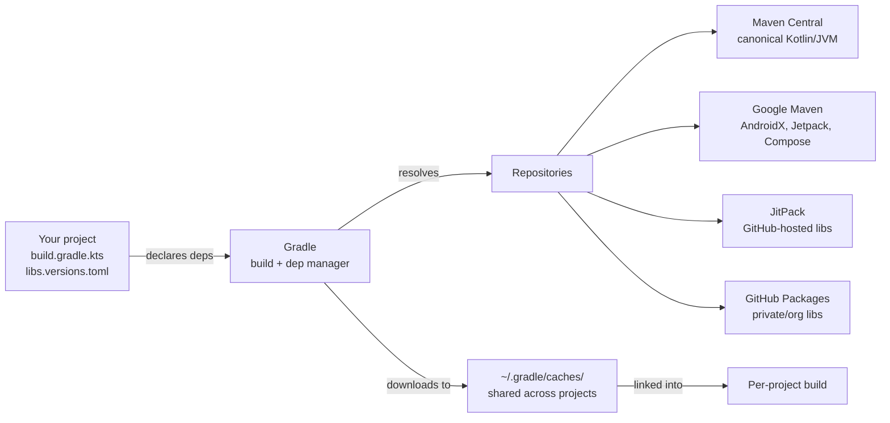

The build system **is** the package manager. There's no `kotlin install foo`. Gradle reads your dependency declarations, resolves them against Maven Central + other repos, downloads `.jar` / `.klib` / `.aar` files into a shared cache, and links them into your build. No separate install step, no virtualenv-style isolation needed — Gradle treats every project as its own dependency tree.

### Comparison: Python (pip/uv) vs Kotlin (Gradle)

| Concept | Python | Kotlin / JVM |
|---|---|---|
| **Registry** | PyPI | Maven Central, Google Maven, JitPack |
| **Installer / resolver** | `pip` / `uv` / `poetry` | **Gradle** (the build system itself) |
| **Manifest** | `pyproject.toml`, `requirements.txt` | `build.gradle.kts` + `libs.versions.toml` |
| **Lockfile** | `uv.lock`, `poetry.lock` | `gradle.lockfile` (opt-in); version catalog acts as soft pin |
| **Isolation** | virtualenv per project | per-project dep tree; **no concept of "global install"** |
| **Cache** | varies (`~/.cache/pip`, `.venv/`) | `~/.gradle/caches/` shared across all projects |
| **Add a dep** | `uv add httpx` | edit catalog + `build.gradle.kts`, run `./gradlew build` |
| **Remove a dep** | `uv remove httpx` | delete the lines |
| **Discover packages** | `pypi.org` | `mvnrepository.com`, `central.sonatype.com`, `klibs.io` (KMP) |
| **Coordinate format** | `httpx==0.27.0` | `group:artifact:version` → `io.ktor:ktor-client-core:3.0.3` |
| **Transitive resolution** | pip resolver | Gradle resolver — "highest-version-wins" by default |

The closest Python analogue is **uv**: per-project isolation, cached resolver, lockfile-aware. Pip-with-global-install has no Kotlin equivalent — global installs don't exist on this side.

### How it looks in this project

You already have the parts. Here's how they connect.

**`gradle/libs.versions.toml`** — the version catalog. Single source of truth for versions:

```toml
[versions]
ktor = "3.0.3"

[libraries]
ktor-client-core   = { module = "io.ktor:ktor-client-core",   version.ref = "ktor" }
ktor-client-okhttp = { module = "io.ktor:ktor-client-okhttp", version.ref = "ktor" }
```

**`shared/build.gradle.kts`** — references those by symbol, never by version string:

```kotlin
sourceSets {
    commonMain.dependencies   { implementation(libs.ktor.client.core) }
    androidMain.dependencies  { implementation(libs.ktor.client.okhttp) }
}
```

Why two files? Bump `ktor = "3.0.4"` in the catalog and every module's reference updates. Same role as a `[project.dependencies]` block plus `[tool.uv.sources]` pinning in `pyproject.toml`.

### Daily commands

| Task | Command |
|---|---|
| Add a dep | edit `libs.versions.toml` + `build.gradle.kts`, then `./gradlew build` |
| See dep tree | `./gradlew :shared:dependencies` |
| Find what pulls in a transitive dep | `./gradlew :shared:dependencyInsight --dependency okhttp` |
| Refresh from remote (ignore cache) | `./gradlew build --refresh-dependencies` |
| Verbose resolution | `./gradlew build --info` |

### The Kotlin Multiplatform twist

When you depend on `io.ktor:ktor-client-core` in a KMP project, Gradle does something pip/uv can't: it resolves a **different variant per target** from the same coordinate:

- JVM bytecode `.jar` for Android/JVM
- A `.klib` for `iosArm64`
- A `.klib` for `linuxX64`
- JS modules for the web

This is enabled by **Gradle Metadata** files the library publisher ships alongside the artifacts. One coordinate, many compiled forms. That's why `commonMain` can depend on `ktor-client-core` while per-target source sets pick engine-specific extras (`ktor-client-okhttp`, `ktor-client-darwin`, etc.) — Gradle wires the right binary in for each target automatically.

### Other build systems exist but Gradle dominates

| Tool | Status |
|---|---|
| **Gradle** | Standard. Required for KMP. What this project uses. |
| **Maven** | Older XML-based. Common for pure JVM/server projects. Not viable for KMP. |
| **Bazel** | Rare outside Google. Powerful but heavy setup. |
| **Amper** (JetBrains, experimental) | New attempt at a simpler-than-Gradle config. Worth watching, not production-ready. |

### Discovery — where to browse libraries

- **`klibs.io`** — KMP-specific library catalog (filter by target: iOS, Android, JS, etc.)
- **`mvnrepository.com`** — best search UX for any JVM library
- **`central.sonatype.com`** — official Maven Central UI
- **`androidx.tech`** — AndroidX/Jetpack library matrix

---

## 12. Tooling

| Tool | Use it for |
|---|---|
| **IntelliJ IDEA** (Community or Ultimate) | Best Kotlin support; KMP plugin enables iOS/Android side-by-side |
| **Android Studio** | Same JetBrains core + Android-specific tooling (emulator, layout inspector) |
| **Fleet** | JetBrains' newer KMP-native IDE — single project view across all targets |
| **VS Code + Kotlin extension** | Fine for reading; weak for refactoring and KMP |
| **`kotlinc -script` REPL** | Quick experiments locally |
| **Kotlin Playground** (play.kotlinlang.org) | Browser REPL — quickest way to try a syntax idea |
| **Kotlin Koans** (built into IDEA) | Interactive exercises — best self-paced intro |

For this project: IntelliJ IDEA Ultimate or Android Studio + the Kotlin Multiplatform Mobile plugin gives you Android + iOS in one window. Xcode is still required for the iOS/macOS apps because they're SwiftUI.

---

## 13. Logging — three categories, pick by target

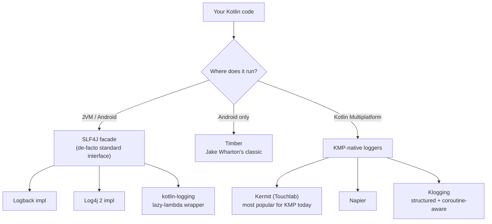

There's no single built-in `logging` module like Python has. Instead, the JVM world standardized on **SLF4J** (a facade interface) with pluggable backends. For KMP — which has to run on iOS, Linux, Windows, and JS too — pure-JVM loggers don't work, so KMP-native libraries fill the gap.

### Python `logging` → Kotlin mapping

| Python | Kotlin/JVM | Kotlin Multiplatform |
|---|---|---|
| `import logging` | SLF4J interface | **Kermit** / Napier / Klogging |
| `logger = logging.getLogger(__name__)` | `private val logger = KotlinLogging.logger {}` | `private val logger = Logger.withTag("Foo")` |
| `logger.debug("got %s", x)` | `logger.debug { "got $x" }` (lazy lambda) | `logger.d { "got $x" }` |
| `logging.basicConfig(level=INFO)` | `logback.xml` or programmatic | `Logger.setMinSeverity(Severity.Info)` |
| Handlers | Appenders (Logback) | Sinks / `LogWriter` |
| Formatters | Layout patterns | per-platform |
| `structlog` | Logback + `logstash-logback-encoder` (JSON) | **Klogging** (structured by default) |
| `loguru` | `kotlin-logging` | Kermit |
| Levels: DEBUG/INFO/WARNING/ERROR/CRITICAL | TRACE/DEBUG/INFO/WARN/ERROR | Verbose/Debug/Info/Warn/Error/Assert |

### The lazy-lambda idiom — different from Python

This is the one pattern you'll see everywhere in Kotlin logging:

```kotlin
// Python — the f-string is always evaluated, even when DEBUG is disabled:
//   logger.debug(f"loaded {expensive_repr(obj)}")

// Kotlin — the block is only run if DEBUG is enabled:
logger.debug { "loaded ${expensiveRepr(obj)}" }
```

The trailing `{ }` is a lambda. The string formatting (and the `expensiveRepr` call) only runs when the level is active. It's the API-level version of Python's `if logger.isEnabledFor(DEBUG): logger.debug(...)` guard, baked in so you never need to write it.

### What fits this project

`abkMyIP` runs on 8 targets — a JVM-only logger won't reach iOS, Linux, Windows, or JS. Three KMP-native picks:

| Library | When to pick it | Why |
|---|---|---|
| **Kermit** (`co.touchlab:kermit`) | **default recommendation** | Most popular KMP logger; every target this project has; simple API; Crashlytics + OSLog sinks built in |
| **Napier** | older codebases | Works fine but development has slowed; Kermit is more active |
| **Klogging** | when you need structured JSON logs from day one | Coroutine-aware, structured fields are first-class, but smaller community |

### Wiring Kermit (if you decide to add it)

Catalog entry in `gradle/libs.versions.toml`:

```toml
[versions]
kermit = "2.0.4"

[libraries]
kermit = { module = "co.touchlab:kermit", version.ref = "kermit" }
```

Reference in `shared/build.gradle.kts`:

```kotlin
commonMain.dependencies { implementation(libs.kermit) }
```

Use anywhere in `commonMain`:

```kotlin
private val logger = Logger.withTag("IpApiService")

logger.d { "fetching ip info" }
logger.i { "got ${info.city}" }
logger.e(throwable) { "request failed" }
```

Output goes to **Logcat** on Android, **OSLog** on iOS/macOS, **stderr** on Native/JVM, and **`console.log`** on JS — automatically, per target. You write one log call; the engine routes it to the right place.

### One philosophy carried over from your CLAUDE.md

Project rule: **"don't mock the logger — log output may change without invalidating a test."** The reason is that log strings are presentation, not behavior. Tests should assert on return values and observable state, not on what the logger printed. This rule applies regardless of which logger you adopt — Kermit's `TestLogWriter` (which captures logs for inspection) exists, but the rule says don't reach for it just to verify a `.d { }` call happened.

---

## 14. Interop notes

### JVM ↔ Kotlin

100% bidirectional. Call any Java library from Kotlin transparently; Java callers see Kotlin classes as normal Java types (with some name mangling for `companion object` members — `User.Companion.create()` from Java vs `User.create()` from Kotlin).

### Native ↔ Swift / Objective-C

Kotlin/Native produces an Apple framework. Swift sees Kotlin classes as Objective-C classes, with mangled names (`KMPName` style, often prefixed with the framework name). The bridge handles primitives, collections, and `suspend fun` (as Swift `async` since Kotlin 1.9). Generics partially erase — collections of primitives box. `cinterop` lets you wrap C headers (we use it implicitly via the Curl engine on Linux).

Xamarin folks: this feels like the Objective Sharpie / binding-projects flow, but better-integrated and auto-generated.

### JS ↔ Kotlin

`dynamic` is the escape hatch — anything typed `dynamic` becomes "trust me" and skips type checks. `external` declarations describe JS libraries to the Kotlin type system. Coroutines map to JS `Promise` at the boundary.

---

## 15. From Xamarin to KMP — bridging the analogy

If you did Xamarin.Forms / MAUI, the mental shift is:

| Xamarin / MAUI | Kotlin Multiplatform |
|---|---|
| Share UI **and** logic via XAML + C# | **Share logic only**, build native UI per platform |
| One language (C#) everywhere | Kotlin for shared + Android; SwiftUI for Apple; TS/JS for Web possible |
| Single binary per platform with shared XAML renderer | Native binary or framework per platform with shared business logic |
| Hot reload across platforms | Compose live preview (Android) + SwiftUI preview (Apple) — separately |

The KMP philosophy: **the UI is the part users actually feel, so don't compromise it**. Logic, networking, business rules — share. Rendering — native every time. This project's `apps/androidApp` (Compose), `apps/iosApp` + `apps/macosApp` (SwiftUI), `apps/webApp` (DOM), `apps/linuxApp` + `apps/windowsApp` (CLI) all consume the same `shared/` module.

**Compose Multiplatform (CMP)** is a separate JetBrains product that does share UI across Android/iOS/desktop/web — like Xamarin's promise but Kotlin-based. We're not using it here; worth knowing it's an option if pixel-identical cross-platform UI becomes a goal later.

---

## 16. One-page cheat sheet

| You want to… | You'd write in… | …in Kotlin |
|---|---|---|
| Immutable variable | Python `x = 1` (no enforcement) / TS `const x = 1` / C# `readonly` | `val x = 1` |
| Mutable variable | Python `x = 1` / TS `let x = 1` / C# `var x = 1` | `var x = 1` |
| Record / DTO | Py `@dataclass class P` / TS `interface` / C# `record` | `data class P(val name: String, val age: Int)` |
| Singleton | Py module / TS `const S = {…}` / C# `static class` | `object S { fun work() = … }` |
| Static method on a class | C# `static T Create()` | `companion object { fun create() = … }` |
| Extension method | C# `static class StringExt { static int Words(this string s) }` | `fun String.words() = split(" ").size` |
| Nullable type | TS `string \| null` / C# `string?` | `String?` |
| Null-safe call | TS `s?.length` / C# `s?.Length` | `s?.length` |
| Null default | TS `s ?? "x"` / C# `s ?? "x"` | `s ?: "x"` |
| Pattern-match on type | TS `if (typeof x === "string")` / C# `switch (x) { case string s: }` | `when (x) { is String -> … }` |
| Sealed hierarchy | C# `sealed record` | `sealed interface Result { data class Ok(val v: T): Result; object Loading: Result }` |
| Async function | TS / C# `async` | `suspend fun` |
| Parallel two awaits | C# `await Task.WhenAll(a, b)` | `coroutineScope { val x = async {…}; val y = async {…}; x.await() to y.await() }` |
| Stream / observable | C# `IAsyncEnumerable<T>` | `Flow<T>` with `emit()` |
| String interpolation | Py `f"hi {x}"` / TS `` `hi ${x}` `` / C# `$"hi {x}"` | `"hi $x"` or `"hi ${x.upper()}"` |
| Lambda | Py `lambda x: x*2` / TS `x => x*2` | `{ x -> x*2 }` or `{ it * 2 }` |
| Map + filter | Py list comp / TS `.map().filter()` | `list.map { it*2 }.filter { it > 10 }` |
| Iterate with index | Py `enumerate` | `list.forEachIndexed { i, v -> … }` |
| Try-finally on a resource | C# `using` / Py `with` | `resource.use { it.read() }` |

---

## 17. Where to go next

- **Official docs**: <https://kotlinlang.org/docs/home.html>
- **Kotlin Koans** (built into IntelliJ): the fastest hands-on intro — Help → Edu Tools → Browse Courses
- **Kotlin Multiplatform docs**: <https://kotlinlang.org/docs/multiplatform.html>
- **Coroutines deep dive**: <https://kotlinlang.org/docs/coroutines-guide.html>
- **KotlinConf talks** (YouTube): @Kotlin channel — "Inside Coroutines" and "Inside Kotlin Multiplatform" are excellent
- **This project's architecture**: [`architecture.md`](architecture.md) — module graph, layered design, request flow
- **This project's roadmap**: [`todo/todo_list.md`](todo/todo_list.md)

When you finish reading, the success test: open `shared/src/commonMain/kotlin/com/abk/myip/AbkMyIp.kt` and the per-target `Platform.*.kt` files. You should be able to read them straight through without needing to look anything up.
